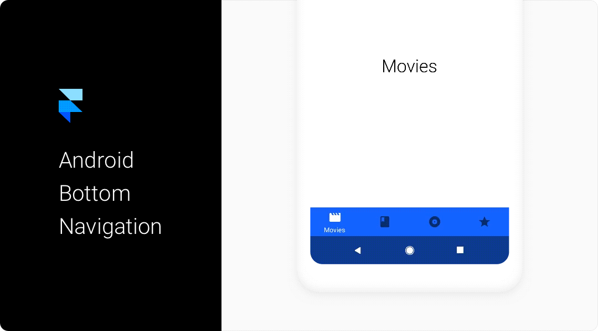

## Installation
To install, place the `BottomNavigation.coffee` file in the `/modules` folder in your Framer project.

## Usage
In Framer Studio, write:
```javascript
{ BottomNavigation } = require "BottomNavigation"
```

Next, instantiate the Bottom Navigation with the following code:
```javascript
bottomNavigation = new BottomNavigation
```

This will create a Bottom Navigation component in it's default state with 4 items using icons that are pulled in from <a href="https://material.io/icons/">Google's Material Icons</a>.

## Customising
The items are created using an array with multiple nested arrays. Each nested array should contain 3 elements, the label name, the icon name, and the color. The color is the color bar background will be set as when the item is selected.

Here's an example of what this should look like.

```javascript
itemData = [["Movies", "movie", "#0F6FFF"], ["Books", "book", "#EE4444"], ["Music", "album", "#7143E5"], ["Favorites", "star", "#FF5722"]]
```

Next, we can create our Bottom Navigation with custom items:

```javascript
bottomNavigation = new BottomNavigation
	items: itemData
```

Each item on the Bottom Navigation corresponds to one of the arrays nested in the top level array called 'itemData' or whatever you name it. There's more custom options too add even further customisation:

| Property | Default Value | Type | Notes
| ------------- | ------------- | ------------- | ------------- |
| colorRipple | false | Boolean | Creates a ripple effect when an item is tapped, using the color of the tapped item |
| defaultActiveItem | 0 | Number | Select which item is active by default |
| items | Array | Array | The data used to create the items |
| backgroundColor | undefined | String | If not set, the bar's background color will be set to the color of whatever the default selected item is |
| color | "rgba(255, 255, 255, .70)" | String | Sets the inactive color for icons |
| activeColor | "rgba(255, 255, 255, 1)" | String | Sets the active color for icons |
| withSystemNav | false | Boolean | Creates a system navigation bar |
| materialIcons | true | Boolean | Set to false when using custom icons |

An example of a more heavily customised component may look like this:

```javascript
bottomNavigation = new BottomNavigation
	colorRipple: true
	defaultActiveItem: 0
	items: itemData
	color: 'rgba(0, 0, 0, .54)'
	activeColor: 'rgb(255, 255, 255)'
	withSystemNav: true
	materialIcons: true
```

# Using Material Icons
By default, the component uses Google's Material Icon set. This is as simple as setting the second string in each array to the name of the icon you would like to use.
A full list of all icons can be found at <a href="https://material.io/icons/">Google's Material Icons</a>. Make sure you use the exact name as it's spelled or the icon won't be imported.

# Using Custom Icons
If needed custom icons can be used by replacing the Material Icon's name with some SVG path data. To keep your prototype tidy, I recommend storing the path data for each icon in it's own variable. Heres a simple example:

```javascript
photos = "M6 0h10a6 6 0 0 1 6 6v10a6 6 0 0 1-6 6H6a6 6 0 0 1-6-6V6a6 6 0 0 1 6-6zm0 2a4 4 0 0 0-4 4v10a4 4 0 0 0 4 4h10a4 4 0 0 0 4-4V6a4 4 0 0 0-4-4H6zm9.99 8.223a5 5 0 1 1-9.893 1.467 5 5 0 0 1 9.892-1.467zM11.482 7.99a3 3 0 1 0-.88 5.935 3 3 0 0 0 .88-5.935z"
```

To use the custom icon, you just need to change the 'materialIcons' option to 'false':

```javascript
materialIcons: false
```

Then replace the names of the Material Icon's with variable name of your custom icons:

```javascript
itemData = [["Photos", photos, "#0F6FFF"],["Cloud", cloud, "#0ECFB8"], ["Explore", compass, "#8920E6"], ["Camera", camera, "#F5A613"]]
```

## Contact
Say Hi, I’m on <a href="https://twitter.com/johnmpsherwin">Twitter 👋</a>.

Follow me on <a href="https://dribbble.com/johnsherwin">Dribbble 🏀</a>.
